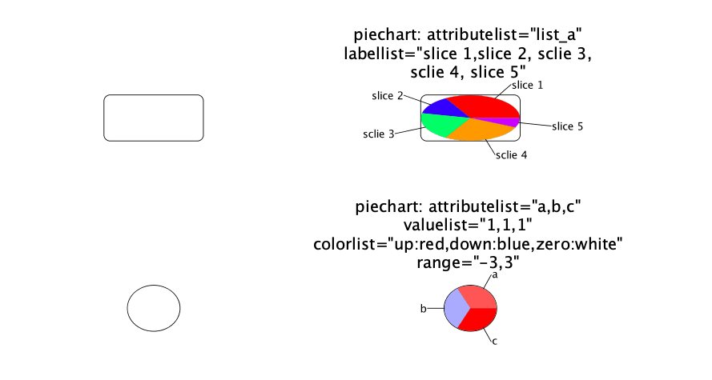

# enhancedGraphics
App to add enhanced node graphics to [Cytoscape 3](https://cytoscape.org).

This documentation is valid for enhancedGraphics version **1.5.3**.

## Presentation

The enhancedGraphics app adds a set of visual style passthrough mappings for node custom graphics.
These mappings are all of the form:

`type: argument1="val1" argument2="val2" ...`

where `type` is the type of chart or gradient and the arguments are the instructions for constructing that chart or graphic.
Adding the desired mappings to a column in the default node table, and creating a style that utilizes that column to passthrough to one of the **Custom Graphics** visual attributes will add that graphic to the node referenced by that row in the node table.
Note that there is no requirement that nodes have the same mapping or even the same type of mapping.
Each of the individual types and their arguments are explained below.

## Types

- [Bar](#bar)
- [Circos](#circos)
- [Heatstrip](#heatstrip)
- [Label](#label)
- [Line](#line)
- [Linear gradient](#linear-gradient)
- [Pie](#pie)
- [Radial gradient](#radial-gradient)
- [Stripe](#stripe)

---

### Bar

Paints a bar chart onto the node, according to the arguments provided.

#### Arguments
- `attributelist` *String* **(required[*](#req-bar))**

  Comma-separated list of node table columns that contain the values for the bars.
  The type of the table columns should be `Double`.

- `valuelist` *String* **(required[*](#req-bar))**
  
  Comma-separated list of the values for the bars.
  This is **ignored** if `attributelist` is given.

- `colorlist` *String* - *Default: `contrasting`*
  
  The [color list](#colors) of each bar or the [scaling colors](#colors).

- `range` *String*

  Minimum and maximal value of the bars.
  The string should be formatted as follows: `min,max`, where `min` and `max` are floating points.
  
- `scale` *Double* - *Default: `1.0`*
  
  Scale to apply to the whole chart.
  
- `showyaxis` *Boolean* - *Default: `false`*
  
  Should the y axis be displayed?
  
- `ybase` *Double* - *Default: `0.5`*
  
  The vertical base of the chart as a proportion of the height.
  By default, this is 0.5 (the center of the node), to allow for both positive and negative values.
  If, however, you only have positive values, you might want to set this to 1.0 (the bottom of the node).
  Note that this goes backwards from what might be expected, with 0.0 being the top of the node and 1.0 being the bottom of the node.
  The keywords `bottom`, `middle` and `top` are also supported.
  
- `separation` *Integer* - *Default: `0`*

  The separation between any two bars.

- `bordercolor` *String* - *Default: `black`*

  The [single color](#colors) of the bar borders.

- `borderwidth` *Double* - *Default: `0.1`*

  Width of the bar borders.
  
- `labellist` *String* - *Default: the `attributelist` is used*

  Comma-separated list of the labels.
  If one label has a comma, it should be escaped as the follows: `\\\,`.
  If no `labellist` is given, the labels will be the name of the attributes.
  
- `showlabels` *Boolean* - *Default: `true`*
  
  Should the labels be printed?

- `labelfont` *String* - *Default: `SansSerif`*

  Font family of the labels.

- `labelsize` *Integer* - *Default: `8`*

  Font size of the labels.

- `labelstyle` *String* - *Default: `plain`*

  Font style of the labels.
  Must be one of:
  - `plain`
  - `italics`
  - `bold`
  - `bolditalic`

- `labelcolor` *String* - *Default: `black`*

  The [single color](#colors) of the labels.

- `labelwidth` *Double*

  Maximal width that a label should have.
  The unit is the same as node sizes.
  If the text is to long to fit, new lines are created so that the text fit in the width.
  If `labelwidth` is not given, the label will be on one line.
  
- `labelspacing` *Double* - *Default: `1.0`*

  In case the label is on several lines, this is the size of the space between two lines.
  The unit is the same as node sizes.

**[*](#bar)** at least one of the arguments is required.

#### Examples

- `barchart: attributelist="a,b,c,d" colorlist="up:yellow,down:green"`

  In this example, the values of `a`,`b`,`c`, and `d` are `2.0`, `0.5`, `4.0`, and `-1.0`.
  Because no range is given, the positive values are yellow and the negative value is green.

- `barchart: valuelist="4,5,3" labellist="A,B,C"  ybase="bottom" showyaxis=true separation=4 range="2.5,5"`
  
  In this example, the values are all positives, so we place the chart at the bottom of the node.
  To emphasize on the difference between the bars, we zoom on the area \[2.5,5\] of the chart and display the Y axis.

---

[List of types](#types)

---

### Circos

This chart type displays the values passed as arguments as a concentric circles with portions of the circle (slices) divided according to the values provided.

#### Arguments

- `attributelist` *String*  **(required[*](#req-circos))**

  Comma-separated list of node table columns that contain the values for the slices.
  The type of the table columns should be `List of Double`.
  The chart will have as many circles as attributes.
  All attributes are list of floating points, and they must have the same number of elements.
  
  If no `valuelist` is given, an attribute will be considered as a value.
  In this case, the attributes will represent the size of a slice and thus must be **positive**.

- `valuelist` *String* **(required[*](#req-circos))**
  
  Represent the size of slices. The values should be **positive**.
  
  The `valuelist` argument can be:
  - a comma-separated list of **positive** floating points, all the circles will have the same slice sizes.
  - a list of comma-separated list of values formatted as follows:
    `[circle1_slice1,circle1_slice2,circle1_slice3],[circle2_slice1,circle2_slice2,circle2_slice3]`
    where `circleX_sliceY` is a **positive** floating point value representing the size of the given slice from the given circle.
    
    *Note*: The values of each circle are independent, they represent a proportion of the slice in the circle.
    For example, `[2,2,2],[3,3,3]` is equivalent to `1,1,1` even if the values are different, they represent the same proportion.
    
    The first circle is the inner circle, the last circle is the outer circle.
  
  If no `valuelist` is given, the `attributelist` will be treated as a `valuelist`.

- `colorlist` *String* - *Default: `contrasting`*
  
  The `colorlist` argument can be:
  - a [color list](#colors) or [scaling colors](#colors) defining the color scheme for all the slices of all circles.
  - a list of color schemes formatted as follow:
    `[color_circle1],[color_circle2]`
    where `color_circleX` is a [color list](#colors) or [scaling colors](#colors) for the specific circle.
    It means that each circle can have a different color scheme.

- `range` *String*

  Minimum and maximal value of the slices.
  The string should be formatted as follows: `min,max`, where `min` and `max` are floating points.

- `arcstart` *Double* - *Default: `0.0`*
  
  The angle in degrees to start the slices. `0` points east, `90` points south, etc.
  
- `arcdirection` *String* - *Default: `counterclockwise`*
  
  The direction in which the slices are drawn.
  Must be one of:
  - `clockwise`, `clock`, `cw`: the slices are drawn clockwise.
  - `counterclockwise`, `anticlockwise`, `ccw`, `acw`: the slices are drawn anti-clockwise.

- `firstarc` *Double* - *Default: `0.2`*
  
  Where to begin the first circle, as a proportion of the entire node.
  `0` means that the first circle is a pie.
  `1` means that the first circle is around the node.

- `arcwidth` *Double* - *Default: `0.1`*
  
  The width of each circle but the first, as a proportion of the entire node.
  The default value `0.1` means that the arc width is equals to 10% of the node width.

- `firstarcwidth` *Double* - *Default: `0.1`*
  
  The width of the first circle, as a proportion of the entire node.
  The default value `0.1` means that the arc width is equals to 10% of the node width.

- `bordercolor` *String* - *Default: `black`*

  The [single color](#colors) of the slice borders.

- `borderwidth` *Double* - *Default: `0.1`*

  Width of the slice borders.
  
- `labellist` *String*

  Comma-separated list of the **slice** labels.
  Only the outer circle will have the labels.
  If one label has a comma, it should be escaped as the follows: `\\\,`.
  
- `showlabels` *Boolean* - *Default: `false`*
  
  Should the **slice** labels be printed?
  
- `circlelabels` *String*
  
  Comma-separated list of the **circle** labels.
  If one label has a comma, it should be escaped as the follows: `\\\,`.
  
- `labelcircles` *String*
  
  The position of the circle labels.
  Must be one of:
  - `east`
  - `west`

- `labelfont` *String* - *Default: `SansSerif`*

  Font family of the labels.

- `labelsize` *Integer* - *Default: `8`*

  Font size of the labels.

- `labelstyle` *String* - *Default: `plain`*

  Font style of the labels.
  Must be one of:
  - `plain`
  - `italics`
  - `bold`
  - `bolditalic`

- `labelcolor` *String* - *Default: `black`*

  The [single color](#colors) of the labels.

- `labelwidth` *Double*

  Maximal width that a label should have.
  The unit is the same as node sizes.
  If the text is to long to fit, new lines are created so that the text fit in the width.
  If `labelwidth` is not given, the label will be on one line.
  
- `labelspacing` *Double* - *Default: `1.0`*

  In case the label is on several lines, this is the size of the space between two lines.
  The unit is the same as node sizes.

**[*](#circos)** at least one of the arguments is required.

#### Examples

- `circoschart: attributelist="list_a,list_b,list_c" colorlist="up:yellow,down:green" labellist="node 1\\\, slice 1,node 1\\\, slice 2,node 1\\\, slice 3,node 1\\\, slice 4" firstarc=1 arcwidth=.3 valuelist="1,1,1,1"`

  In this example, the values of `list_a`, `list_b`, and `list_c` are `[1.0,2.0,3.0,4.0]`, `[-5.0,3.0,-2.0,1.0]`, and `[-1.0,-2.0,-3.0,-4.0]`.
  Because the values are equals, the circles will be split into four same-sized slices.
  No range given, so the positive values will be yellow and the negative values will be green.
  The slices are labelled, the labels will point to the outer circle.
  The chart will be around the node (`firstarc=1`) and the width of the circles is increased compared to the default value.
  
  We can note that the chart fits to the node, even if it is not square (or round).
  In this configuration the chart is an ellipse.

- `circoschart: attributelist="list_a,list_b,list_c" colorlist="up:yellow,zero:white,down:green,missing:black" labellist="slice 1,slice 2,slice 3,slice 4" firstarc=1 arcwidth=.3 valuelist="1,1,1,1" range="-5,5" arcdirection="clockwise"`

  In this example, the values of `list_a`, `list_b`, and `list_c` are `[1.0,2.0,3.0,4.0]`, `[-5.0,NaN,-2.0,1.0]`, and `[-1.0,-2.0,-3.0,-4.0]`.
  Because the values are equals, the circles will be split into four same-sized slices.
  With the range, the colors will scale from green to white or white to yellow depending of the sign of the value, and a missing value will be painted black.
  Here the slices are drawn clockwise (starting at 3 o'clock by default).

- `circoschart: attributelist="list_a,list_b,list_c"  circlelabels="a,b,c" labelcircles="east" firstarc=.1 arcwidth=.3 arcstart=90`
  
  In this example, the values of `list_a`, `list_b`, and `list_c` are `[1.0,2.0,3.0,4.0]`, `[5.0,3.0,2.0,1.0]`, and `[10.0,6.0,3.0,1.0]`.
  Because there is no value, the attributes are used as values.
  The default colors are `contrasting`, in this case the colors are, in order: red, purple, cyan and lime.
  Here the labels are not for the slices but for the circles, they will be drawn on the right side of the node.
  The starting point of the slice will be 12 o'clock (`arcstart=90`) and drawn counterclockwise by default.
  The widths (`firstarc` and `arcwidth`) are calculated so that the chart is inside the node that was previously shaped as a circle.

- `circoschart: valuelist="[1,2,3],[2,1,4]" colorlist="[red,red,darkgreen],[darkgreen,red,black]" firstarc=.7 arcwidth=.3 bordercolor=white borderwidth=1`

  In this example we manually give the values and colors for each slice of each circle.
  We have chosen dark colors, so we use a bright border color, and increased its width compared to default.

---

[List of types](#types)

---

### Heatstrip

This chart type displays the values passed as arguments as a bar chart with the bars showing a gradient between the center and upper and lower values.

#### Arguments
- `attributelist` *String* **(required[*](#req-heatstrip))**

  Comma-separated list of node table columns that contain the values for the bars.
  The type of the table columns should be `Double`.

- `valuelist` *String* **(required[*](#req-heatstrip))**
  
  Comma-separated list of the values for the bars.
  This is **ignored** if `attributelist` is given.

- `colorlist` *String* - *Default: `yellowblackcyan`*
  
  A [scaling color](#colors), or one of the following keywords:
  - `bluegreenyellow`
  - `greenpurple`
  - `orangepurple`
  - `purpleyellow`
  - `redblue`
  - `redgreen`
  - `redyellow`
  - `yellowblue`
  - `yellowcyan`
  - `yellowblackcyan`
  - `yellowwhitecyan`
  
  *Note:* If you define a [scaling color](#colors) using only `up` and `down`, the `zero` will be `black` by default.
  By using a keyword color with only two colors, the gradient will scale from one to another without using a default middle color.

- `range` *String*

  Minimum and maximal value of the bars.
  The string should be formatted as follows: `min,max`, where `min` and `max` are floating points.
  
- `scale` *Double* - *Default: `1.0`*
  
  Scale to apply to the whole chart.
  
- `separation` *Integer* - *Default: `0`*

  The separation between any two bars.

- `bordercolor` *String* - *Default: `black`*

  The [single color](#colors) of the bar borders.

- `borderwidth` *Double* - *Default: `0.1`*

  Width of the bar borders.
  
- `labellist` *String* - *Default: the `attributelist` is used*

  Comma-separated list of the labels.
  If one label has a comma, it should be escaped as the follows: `\\\,`.
  If no `labellist` is given, the labels will be the name of the attributes.
  
- `showlabels` *Boolean* - *Default: `true`*
  
  Should the labels be printed?

- `labelfont` *String* - *Default: `SansSerif`*

  Font family of the labels.

- `labelsize` *Integer* - *Default: `8`*

  Font size of the labels.

- `labelstyle` *String* - *Default: `plain`*

  Font style of the labels.
  Must be one of:
  - `plain`
  - `italics`
  - `bold`
  - `bolditalic`

- `labelcolor` *String* - *Default: `black`*

  The [single color](#colors) of the labels.

- `labelwidth` *Double*

  Maximal width that a label should have.
  The unit is the same as node sizes.
  If the text is to long to fit, new lines are created so that the text fit in the width.
  If `labelwidth` is not given, the label will be on one line.
  
- `labelspacing` *Double* - *Default: `1.0`*

  In case the label is on several lines, this is the size of the space between two lines.
  The unit is the same as node sizes.

**[*](#heatstrip)** at least one of the arguments is required.

#### Examples

In the following examples, the values of the attributes `a`, `b`, `c`, and `d` are `1.0`, `2.0`, `3.0`, `-3.0` respectively.

- `heatstripchart: attributelist="a,b,c,d" showyaxis=true`

  In this example we use the default values, except that we add the Y axis to see the limits of the values.

- `heatstripchart: attributelist="a,b,c,d" colorlist="yellowcyan" showyaxis=true separation=2 showlabels=false`
  
  In this example we change the color scheme, the only difference is the `zero` color which by default is black and here is not used, meaning that the `zero` color is the mix between `up` and `down`, here lime is the mix between yellow and cyan.
  We get rid of the labels and we add some space between the bars.

---

[List of types](#types)

---

### Label

This chart type provides a mechanism to add text labels to nodes that have more display options than the simple labels provided by Cytoscape visual properties.

#### Arguments
- `attribute` *String* **(required[*](#req-label))**
  
  Node table column that contain the text of the label.

- `label` *String* **(required[*](#req-label))**
  
  The text of the label.
  This is **ignored** if `attribute` is given.

- `labelAlignment` *String* - *Default: `middle`*
  
  The way the label should be aligned according to the `position`.
  Must be one of:
  - `none`: `position` is at the top left corner of the label.
  - `left`: `position` is on the left of the label.
  - `center`, `center_top`: `position` is on top of the label, centered horizontally.
  - `center_bottom`: `position` is at the bottom of the label, centered horizontally.
  - `right`: `position` is at the right of the label.
  - `middle`: `position` is at the middle of the label.

- `position` *String* - *Default: `center`*
  
  Where the label position should be calculated from.
  The string can be formatted as `x,y` or one of the following keyword:
  - `center`: the middle of the node
  - `north`: the top border of the node, centered horizontally
  - `northeast`: the top-right corner of the node
  - `east`: the right border of the node, centered vertically
  - `southeast`: the bottom-right corner of the node
  - `south`: the bottom border of the node, centered horizontally
  - `southwest`: the bottom-left corner of the node
  - `west`: the left border of the node, centered vertically
  - `northwest`: the top-left corner of the node

- `anchor` *String* - *Default: `center`*

  Where the label text should be anchored.
  The string can be formatted as `x,y` or one of the following keyword:
  - `center`: the middle of the text
  - `north`: the top border of the text, centered horizontally
  - `northeast`: the top-right corner of the text
  - `east`: the right border of the text, centered vertically
  - `southeast`: the bottom-right corner of the text
  - `south`: the bottom border of the text, centered horizontally
  - `southwest`: the bottom-left corner of the text
  - `west`: the left border of the text, centered vertically
  - `northwest`: the top-left corner of the text
  
- `labeloffset` *String* - *Default: `0,0`*
  
  The offset of the label.
  The string should be formatted as follows: `x,y`, where `x` is the horizontal offset and `y` the vertical offset.

- `labelfont` *String* - *Default: `SansSerif`*

  Font family of the labels.

- `labelsize` *Integer* - *Default: `8`*

  Font size of the labels.

- `labelstyle` *String* - *Default: `plain`*

  Font style of the labels.
  Must be one of:
  - `plain`
  - `italics`
  - `bold`
  - `bolditalic`

- `color` *String* - *Default: `black`*

  The [single color](#colors) of the labels.

- `labelwidth` *Double*

  Maximal width that a label should have (paddings included).
  The unit is the same as node sizes.
  If the text is to long to fit, new lines are created so that the text fit in the width.
  If `labelwidth` is not given, the label will be on one line.
  
- `labelspacing` *Double* - *Default: `1.0`*

  In case the label is on several lines, this is the size of the space between two lines.
  The unit is the same as node sizes.
  
- `padding` *Double* - *Default: `0.0`*
  
  Proportion of the node's width to be used as a padding.
  
- `background` *Boolean* - *Default: `false`*
  
  Should a background be drawn?
  
- `bgColor` *String* - *Default: `white`*
  
  The [single color](#colors) used as the background.
  The background is transparent.
  
- `outline` *Boolean* - *Default: `false`*
  
  Should the letters be outlined?

- `outlineColor` *String* - *Default: `black`*
  
  The [single color](#colors) of the outline.
  
- `outlineTransparency` *Integer*

  The transparency of the outline.
  Should be an integer between `0` and `255`.
  
- `outlineWidth` *Double* - *Default: `0.0`*
  
  Width of the outlines.

**[*](#label)** at least one of the arguments is required.
  
#### Examples

- `label: label="This is text"`
  
  Default values are used: the text is centered in the middle of the node.

- `label: attribute="long_text" labelwidth=75 background=true bgColor=red padding=0.05`

  In this example, the text of the label is read from the attribute `long_text`, which value is `This is a text on several lines`.
  To make the label on several lines, we put a maximum width (the node width is 75).
  To emphasize the label we put a red background.
  To increase readability, we add a padding so that letters are not too close to the node borders.

- `label: label="This is text is on several lines" labelwidth=75 position="northwest" labelAlignment="left" padding=0.05`
  
  In this example we show how to put a text which is not centered.
  We put the text on the top-left corner and we align the text with the right border.

- `label: label="This is text" position="south" labelAlignment="center_top" anchor="north"`

  In this example the label leaves the node.
  We want it to be below the node, so we want the north of the label to be at the south of the node.

---

[List of types](#types)

---

### Line

This chart type displays the values passed as arguments as a line chart on the node.

#### Arguments
- `attributelist` *String* **(required[*](#req-line))**

  Comma-separated list of node table columns that contain the values for the points.
  The type of the table columns should be `Double`.

- `valuelist` *String* **(required[*](#req-line))**
  
  Comma-separated list of the values for the points.
  This is **ignored** if `attributelist` is given.

- `colorlist` *String* - *Default: `contrasting`*
  
  A [color](#colors) for the line, or a [color list](#colors) for each line between two points.
  It is also possible to give a [scaling color](#colors),
  each line between two points will be painted with the `up` color if the difference is positive,
  or with the `down` if the difference is negative.

- `linewidth` *Double* - *Default: `1.5`*
  
  Width of the line

**[*](#line)** at least one of the arguments is required.

#### Examples

- `linechart: attributelist="a,b,c,d" colorlist="up:red,down:blue"`
  
  In this example, the attribute values of `a`, `b`, `c` and `d` are `2.0`, `0.5`, `4.0`, and `-1.0` respectively.
  The colors of the line will depend on the difference between the two points: if it decreases it will be blue, if it increases it will be red.

- `linechart: valuelist="1,4,2,3,0" colorlist="green"`

  In this example, the values are manually given and the line will have only one color.

---

[List of types](#types)

---

### Linear Gradient

This chart type displays a linear gradient on the node.

#### Arguments
- `start` *String* **(required)**

  The starting coordinate of the gradient.
  This must be formatted as follows: `x,y`.
  
  The point `0,0` is the top-left corner of the node.
  The point `1,0` is the top-right corner of the node.
  The point `1,1` is the bottom-right corner of the node.
  The point `0,1` is the bottom-left corner of the node.

- `end` *String* **(required)**

  The ending coordinate of the gradient.
  This must be formatted as follows: `x,y`.
  
  The point `0,0` is the top-left corner of the node.
  The point `1,0` is the top-right corner of the node.
  The point `1,1` is the bottom-right corner of the node.
  The point `0,1` is the bottom-left corner of the node.

- `stoplist` *String* **(required)**
  
  List of stops separated with a vertical bar `|`.
  A stop is a comma-separated list of a color and the proportional distance, formatted as follows:
  `r,g,b,a,s` or `r,g,b,s` where
  - `r` is the red-component of the color (*Integer* in the range [0,255]);
  - `g` is the green-component of the color (*Integer* in the range [0,255]);
  - `b` is the blue-component of the color (*Integer* in the range [0,255]);
  - `a` is the alpha or opacity of the color (*Integer* in the range [0,255]);
  - `s` is the distance of the stop (*Double* in the range [0.0,1.0]) where `0.0` is the beginning of the gradient and `1.0` is the end of the gradient.

#### Examples

- `lingrad: start="0,1" end="1,0" stoplist="0,0,255,255,0.0|255,255,255,255,0.5|255,0,0,255,1.0"`

  In this example, we want a linear gradient that follows the diagonal from the bottom-left corner to the top-right corner.
  We want the starting color to be blue, then in the middle it will be white and at the end it is red.

- `lingrad: start="0,0" end="1,0" stoplist="0,0,255,255,0.0|0,255,255,255,0.25|255,255,0,255,0.75|255,0,0,255,1.0"`

  In this example, the gradient follows the horizontal line.
  We have four colors in the gradient.

---

[List of types](#types)

---

### Pie

This chart type displays the values passed as arguments as a pie chart on the node.

#### Arguments

- `attributelist` *String* **(required)**

  `attributelist` can be two different things:
      - A node table columns that contain the values for the slices.
      The type of the table column should be `List of Double`.
      
      - Comma-separated list of node table columns that contain the values for the points.
      The type of the table columns should be `Double`.
  
  If no `valuelist` is given, an attribute will be considered as a value.
  In this case, the attributes will represent the size of a slice and thus must be **positive**.

- `valuelist` *String*
  
  Comma-separated list of **positive** floating points representing the relative size of the slices.
  
  If no `valuelist` is given, the `attributelist` will be treated as a `valuelist`.

- `colorlist` *String* - *Default: `contrasting`*
  
  A [color list](#colors).

- `range` *String*

  Minimum and maximal value of the slices.
  The string should be formatted as follows: `min,max`, where `min` and `max` are floating points.

- `arcstart` *Double* - *Default: `0.0`*
  
  The angle in degrees to start the slices. `0` points east, `90` points south, etc.
  
- `arcdirection` *String* - *Default: `counterclockwise`*
  
  The direction in which the slices are drawn.
  Must be one of:
  - `clockwise`, `clock`, `cw`: the slices are drawn clockwise.
  - `counterclockwise`, `anticlockwise`, `ccw`, `acw`: the slices are drawn anti-clockwise.

- `firstarc` *Double* - *Default: `0.2`*
  
  Where to begin the first circle, as a proportion of the entire node.
  `0` means that the first circle is a pie.
  `1` means that the first circle is around the node.

- `arcwidth` *Double* - *Default: `0.1`*
  
  The width of each circle but the first, as a proportion of the entire node.
  The default value `0.1` means that the arc width is equals to 10% of the node width.

- `firstarcwidth` *Double* - *Default: `0.1`*
  
  The width of the first circle, as a proportion of the entire node.
  The default value `0.1` means that the arc width is equals to 10% of the node width.

- `outlineColor` *String* - *Default: `black`*

  The [single color](#colors) of the slice borders.

- `outlineWidth` *Double* - *Default: `0.1`*

  Width of the slice borders.
  
- `labellist` *String*

  Comma-separated list of the **slice** labels.
  Only the outer circle will have the labels.
  If one label has a comma, it should be escaped as the follows: `\\\,`.
  
- `showlabels` *Boolean* - *Default: `false`*
  
  Should the **slice** labels be printed?
  
- `circlelabels` *String*
  
  Comma-separated list of the **circle** labels.
  If one label has a comma, it should be escaped as the follows: `\\\,`.
  
- `labelcircles` *String*
  
  The position of the circle labels.
  Must be one of:
  - `east`
  - `west`

- `labelfont` *String* - *Default: `SansSerif`*

  Font family of the labels.

- `labelsize` *Integer* - *Default: `8`*

  Font size of the labels.

- `labelstyle` *String* - *Default: `plain`*

  Font style of the labels.
  Must be one of:
  - `plain`
  - `italics`
  - `bold`
  - `bolditalic`

- `labelcolor` *String* - *Default: `black`*

  The [single color](#colors) of the labels.

- `labelwidth` *Double*

  Maximal width that a label should have.
  The unit is the same as node sizes.
  If the text is to long to fit, new lines are created so that the text fit in the width.
  If `labelwidth` is not given, the label will be on one line.
  
- `labelspacing` *Double* - *Default: `1.0`*

  In case the label is on several lines, this is the size of the space between two lines.
  The unit is the same as node sizes.

#### Examples

- `piechart: attributelist="list_a" labellist="slice 1,slice 2, sclie 3, sclie 4, slice 5"`
  
  In this example, the value of the attribute `list_a` is `[5.0,2.0,3.0,4.0,1.0]`.
  Each slice is labelled and the colors are the default contrasting colors.

- `piechart: attributelist="a,b,c" valuelist="1,1,1" colorlist="up:red,down:blue,zero:white" range="-3,3"`
  
  In this example, the three slices have the same sizes and the colors depends on the values of the attributes `a`, `b` and `c` which values are respectively `2.0`, `-1` and `4.0`.
  Here because some values are not in the range defined, the color assigned is the same as the limit one, in this case, `4.0` is assigned the `up` color because it is greater than the max range.
  The other colors scale from blue to white or white to red.

---

[List of types](#types)

---

### Radial Gradient

This chart type displays a radial gradient on the node.

#### Arguments
- `stoplist` *String* **(required)**
  
  List of stops separated with a vertical bar `|`.
  A stop is a comma-separated list of a color and the proportional distance, formatted as follows:
  `r,g,b,a,s` or `r,g,b,s` where
  - `r` is the red-component of the color (*Integer* in the range [0,255]);
  - `g` is the green-component of the color (*Integer* in the range [0,255]);
  - `b` is the blue-component of the color (*Integer* in the range [0,255]);
  - `a` is the alpha or opacity of the color (*Integer* in the range [0,255]);
  - `s` is the distance of the stop (*Double* in the range [0.0,1.0]) where `0.0` is the beginning of the gradient and `1.0` is the end of the gradient.

- `center` *String* - *Default: `0.5,0.5`*

  The coordinates of the center of the gradient.
  This must be formatted as follows: `x,y`.
  
  The point `0,0` is the top-left corner of the node.
  The point `1,0` is the top-right corner of the node.
  The point `1,1` is the bottom-right corner of the node.
  The point `0,1` is the bottom-left corner of the node.

- `radius` *Double* - *Default: `1`*

  The radius of the gradient as a proportion of the node size.
  The size of the node here is the minimum between the height and width of the node.

#### Examples

- `radgrad: stoplist="0,0,255,255,0.0|255,255,255,255,0.5|255,0,0,255,1.0"`
  
  In this example, we want a radial gradient from blue to white and white to red.
  The default center is the center of the node.
  The default value here is the height of the node because the height is smaller than the width.

- `radgrad: center="0,1" radius=2 stoplist="255,255,0,255,0.2|255,127,0,255,0.75|255,0,0,0.9|55,65,170,255,1.0"`
  
  In this example, we want a radial gradient from the bottom-left corner of the node, with a radius twice as large as the height of the node.
  In this gradient we define four colors with different distances.

---

[List of types](#types)

---

### Stripe

This simple chart type displays the values passed as arguments as a series of stripes on the node.

#### Argument

- `colorlist` *String* **(required)**
  
  The [color list](#colors) of each stripes.
  Here the color list keywords do not work, one can only use a list of single colors.

#### Examples

- `stripechart: colorlist="#051440,white,#EC1920 "`
  
  In this example we define the French flag.

- `stripechart: colorlist="black,#ffe936,#ff0f21"`

  In this example we define the Belgian flag.

---

[List of types](#types)

---

## Colors

There are several ways to define a colors with enhancedGraphics.
One can use a single color to define the color of a text or a border.
It is also possible to define or use predefined color list to fill the color of charts.
In the case of continuous attributes, one can also define scaling colors where the color of each chart element is calculated in function of the value.

### Single color

In order to define a single color, one can use the hexadecimal code `#rrggbb` or `#rrggbbaa` with alpha.
It is also possible to use one of the many usual keywords such as `black`, `white`, `navy`, etc.

### Color list

There are two types of color list: the user-defined and the keywords.

A user-defined list is a comma-separated string of single colors.
The number of colors in the list must fit the number of chart elements to draw.

The app also gives access to four predefined color lists, defined thanks to the following keywords:
- `random`: the colors change every time the chart are drawn (every time the view is changed).
- `rainbow`: the colors from the rainbow, the first element of the list is red, the last is turquoise.
The other elements ranges from red to turquoise so that the number of colors matches the number of chart elements.
- `contrasting`: two consecutive colors will be from opposite sides of the color wheel.
- `modulated`: same as rainbow but the saturation and intensity change.

### Scaling color

If dealing with continuous data, one may want to apply a color scale.
The color scales are defined thanks to four different type of colors:
- `up`: the color for positive values. **(required)**
- `down`: the color for negative values. **(required)**
- `zero`: the color for zero. *Default: `black`*
- `missing`: the color for missing values (`NA`, `NaN`, `null`). *Default: `grey`*

The string defining the color scale is a comma-separated list of `type_of_color:color`.
The string must at least contains the `up` and `down` color types.

*Note:* Only if the `range` argument is given the color will be scaled.
Otherwise all positive values will be assigned with the `up` color and all negative values with the `down` color.
With the `range` argument, the color depends on the value of the attribute and will be scaled from `zero` to `up`, if positive, or `down`, if negative.

*Examples:*
- `up:red,down:blue`
- `up:red,zero:white,down:#0000ff`
- `up:darkred,down:navy,zero:white,missing:black`
